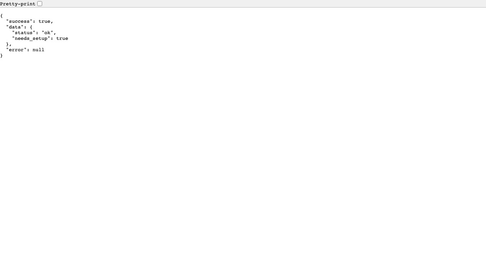
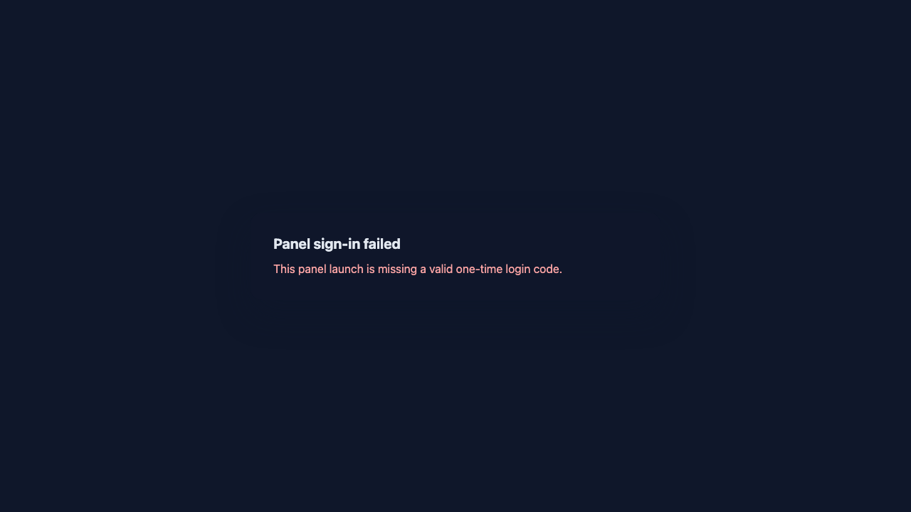

<!-- docs-i18n-links:start -->
[EN](./runtime-quickstart.md) | [JP](../i18n/ja/tutorials/runtime-quickstart.md) | [KR](../i18n/ko/tutorials/runtime-quickstart.md) | [CN](../i18n/zh-cn/tutorials/runtime-quickstart.md)
<!-- docs-i18n-links:end -->

# Tutorial: Runtime Quickstart

This tutorial is the quickest way to get to the point where runtime is working with your current repository.

## Assumptions

- work in repo route
- Can use Python

## Step 1. Run health check

```bash
python -m rumi_ai --health
```

If `status: "UP"` or `status: "DEGRADED"` is returned, the runtime is ready to start (`DOWN` needs to be investigated).

## Step 2. Start runtime

```bash
python -m rumi_ai --headless
```

If `[Rumi] startup.success` appears, startup is complete.

## Step 3. API communication confirmation

In another terminal:

```bash
curl http://127.0.0.1:8765/health
```

If it returns HTTP 200 and JSON, the API is available.

## Step 4. Panel route confirmation (optional)

Open `http://127.0.0.1:8765/panel/` in your browser and make sure the screen is visible.

## Step 5. Stop

In the launched terminal, `Ctrl+C`.

## Verification screenshot

> This is an image obtained during execution confirmation. The display may vary slightly depending on the environment.

### /health (browser display)



### /panel (browser display)



## Execution log

The raw log of execution is saved below.

- [../assets/tutorials/runtime-quickstart.log](../assets/tutorials/runtime-quickstart.log)

## Read next

- Follow the mechanism: [../concepts/system-mechanism.md](../concepts/system-mechanism.md)
- Operation/API details: [../operations.md](../operations.md)
- Viewer side startup path: [../rumi_viewer_start.md](../rumi_viewer_start.md)
