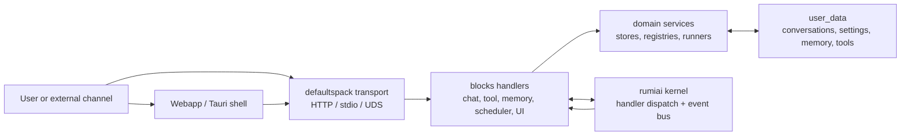
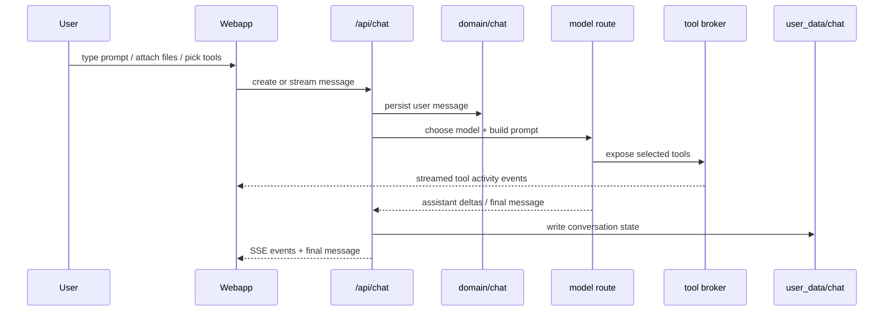
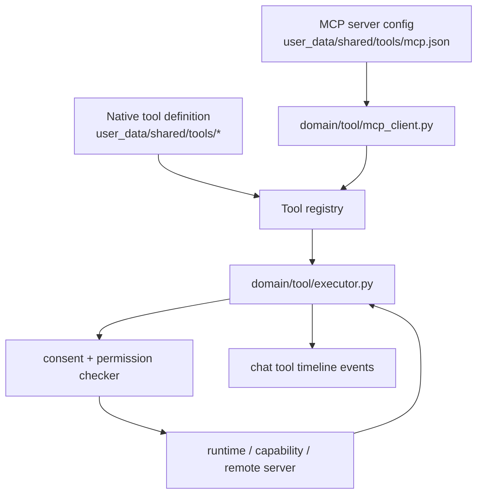
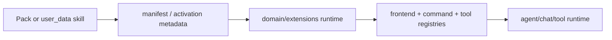
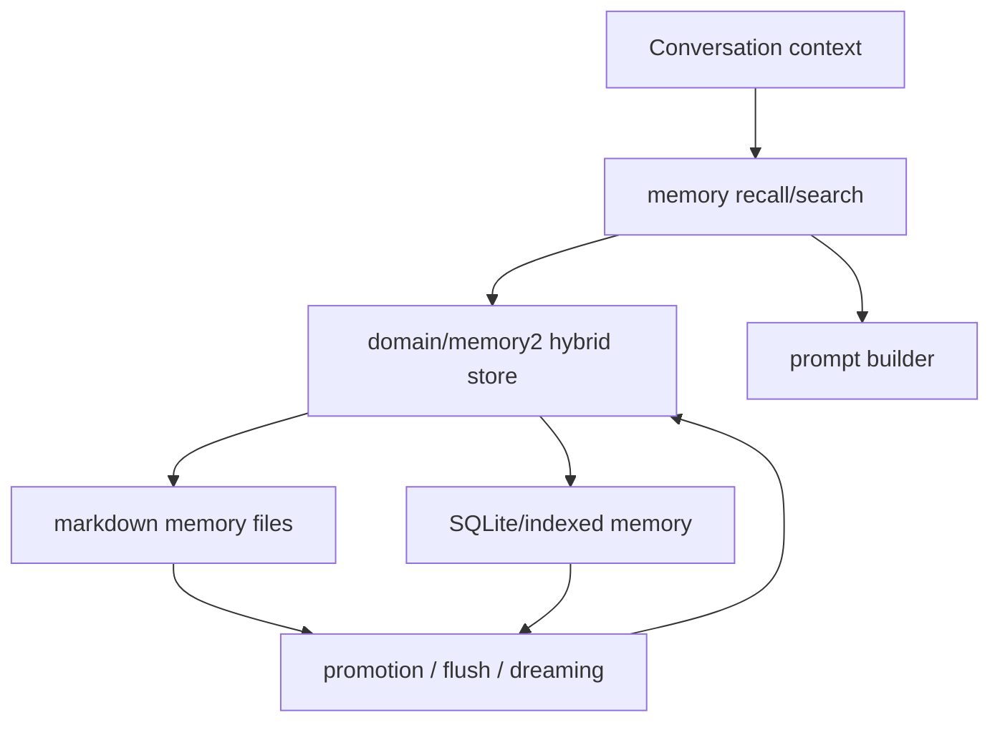
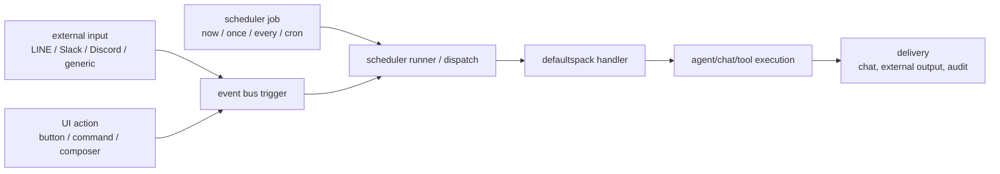

<!-- docs-i18n-links:start -->
[EN](../../defaultspack-explained.md) | [JP](./defaultspack-explained.md) | [KR](../ko/defaultspack-explained.md) | [CN](../zh-cn/defaultspack-explained.md)
<!-- docs-i18n-links:end -->

#defaultspack の説明

このドキュメントは、defaultspack の PR97 方向マップです。どのようにして
ローカルファースト UI、チャット ランタイム、ツール、MCP、スキル、メモリ、スケジューラ、トリガー
カーネルがドメイン固有の情報を認識する必要がなくても、サーフェスは結合されます。
行動。

## 全体像

defaultspack は、rumiai の標準「AI サービス」パックです。カーネルが提供するのは、
パックのロード、ハンドラーのディスパッチ、イベント、およびトランスポートのプリミティブ。デフォルトパック
具体的なチャット、ツール、メモリ、スケジューラ、フロントエンドの動作を提供します。
ユーザー体験。

重要な境界は、コンテンツが削除可能なままであるということです。デフォルトパックの消耗品
インフラストラクチャとデフォルト。 user_data および他のパックは UI を置き換えることができます
アセット、プロンプト、ツール、エージェント、スケジュール、メモリ ファイル、スキル定義。

## UI とチャットの流れ

`webapp/` のスタンドアロン Web アプリは、によって公開される `/api/...` エンドポイントと通信します。
デフォルトパック。 UI は、履歴、チャット メッセージ、コンポーザー、
アクティビティ プレビュー、右側のサイドバー、設定、およびオプションのコーディング コックピット領域。

チャット メッセージは単なるテキストではありません。コンテンツブロック、ウィジェット、ツールを運ぶことができます
ログ、ブラウザのスクリーンショット、アクティビティ イベント。レンダラーがその量を決定します
メッセージ タイムラインとアクティビティに表示される構造化データ
プレビューペイン。

## ツールと MCP の流れ

ネイティブ ツールと MCP ツールは同じツール レジストリと実行の背後に集約されます
契約。モデルは統合されたカタログを参照します。実行者はツールかどうかを決定します
ローカル、機能ベース、HTTP ベース、または MCP ベースです。

MCP の統合は、通話時に意図的に透過的に行われます。のようなツール
`mcp_fs_read_file` は、同じ `defaults.tool.invoke` パスを通じて呼び出されます。
ネイティブツール。承認モード、権限、監査動作は維持されます。
要求したモデルではなく、ツール呼び出し。

### 証拠に基づく検証

PR97 チェックでは、補助散文や固定マーカー文字列を証拠として扱ってはなりません。
証拠は、モデルが偽装できないことを示す構造化された実行時の証拠に存在します。
同様のテキストを入力します。

アシスタントのメッセージ テキストは、ツール、MCP サーバー、スキル、トリガー、
または、実際に実行されたチャット コンテキストがドロップされました。 「私はツールを使用しました」などの散文を次のように扱います。
テキストのみを表示します。合否の決定は、によって生成された構造化レコードを読み取る必要があります。
ブラウザ/プレイライトによって観察されるランタイムまたは目に見える UI の状態。

|クレーム |確認すべき証拠 |
|---|---|
| MCPはRumiさんで使えました |アシスタント メッセージ `tool_logs`、`tool_call_started`、および `tool_call_completed` には、MCP ツール ID と結果が含まれています。
|発動したスキル |アシスタントのメタデータには `matched_skill_instructions` が含まれており、準備されたシステム コンテキストにはレンダリングされたスキルの指示が含まれています。
|ドロップされたチャットが参照されました |ユーザー メタデータには、`chat_references.references[]` と `conversation_id`、概要、および `history_json_path` が含まれています。
| | を送信せずにトリガーが起動されました。外部パイプライン メタデータには `fire=true` および `send=false` があります。
| UI プレビューが開きました | Playwright/Browser は、模擬アシスタントの文ではなく、実際のフォアグラウンド ダイアログまたはタイムライン アイテムを観察します。

決定論的テストの場合は、動的入力を使用し、最終的な答えが次であることをアサートします。
ツールの結果から派生します。ライブブラウザスモークテストの場合、合格/不合格を維持します。
`tool_logs`、メタデータ、および表示される UI 状態の条件。アシスタントテキストは
人間が判読できる副作用のみです。

API のみのチェックは、ブラウザ/Playwright フローが失敗した場合の診断として許可されます。
しかし、それ自体ではブラウザのワークフローが機能することを証明するものではありません。 UI契約
`/api/...` をモックするテストは、モックされた UI カバレッジとして名前を付けて保持する必要があります。
ライブ MCP 証拠テストとは別に、サーバー、承認、
テスト内の許可と nonce 状態。

## スキルと拡張機能

スキルは、エージェントやツールの実行を支援するパッケージ化された動作と指示です。
特殊なワークフロー。 defaultspack はそれらを拡張コンテンツとして扱います。
ハードコードされたランタイムの知識よりも。

同じ拡張パスにコマンド、パネル、ツール メタデータ、プロンプト、または
エージェントの機能。 UI はこれらをカタログ データとして受け取り、レンダリングします。
パック固有のコードを必要とせずに、サイドバーまたはコンポーザーを使用できます。

## メモリフロー

メモリは、会話状態、長期存続するユーザー/プロジェクトのメモリ、および
検索可能な知識。チャットとエージェントの実行では、コンテキストの構築時にメモリを読み取ることができます
承認またはポリシーのチェック後に永続的な事実を書き戻すことができます。

デフォルトのローカルファーストルールでは、メモリはユーザー制御の下に保存されます。
パス。クラウド ベクター ストアやリモート ナレッジ バックエンドは後から追加できますが、
これらはオプションのプロバイダーであり、アクセス許可ゲート型である必要があります。

## スケジューラとトリガーのフロー

スケジューラとトリガーは、同じハンドラーとイベント システムへのエントリポイントです
UIによって使用されます。トリガーは、タイム スケジュール、外部 Webhook、
フロントエンド アクション、P2P/企業イベント、または別のハンドラー。

`no_agent` スケジューラ ジョブは意図的に制限されています。エージェントの仕事は、
通常のパスは、会話のコンテキスト、権限、承認、
そして監査記録。

## リクエスト サーフェス

|表面 |例 |デフォルトのパス |
|---|---|---|
| UIチャット |ユーザーがコンポーザー プロンプトを送信する | `/api/chat/conversations/{id}/stream` |
| UI アクション |サイドバー アクションで結果をプレビューする | `/api/ui/catalog` プラス アクション エンドポイント |
|ツール呼び出し |モデルはネイティブまたは MCP ツールを呼び出します。 `defaults.tool.invoke` |
| MCP |サーバーは外部ツールを公開します | `domain/tool/mcp_client.py` |
|スキル |パックはワークフローの動作に貢献します | `domain/extensions/*` |
|メモリ |プロンプトビルダーがコンテキストを呼び出す | `domain/memory*` |
|スケジューラー |時間または要求に応じてジョブを起動 | `/api/agent/schedules` |
|トリガー | Webhook/イベントがランタイムに入ります |ゲートウェイ、スケジューラ、またはイベント バス |

## 運用ルール

- カーネルを汎用的に保ちます。 AI サービス ドメインの動作をdefaultspack に追加します。
- ユーザーデータを置き換え可能に保ちます。デフォルトでは、ロックインではなくスロットとコントラクトが提供されます。
- ローカルファースト操作を優先します。リモートプロバイダーはオプトインです。
- ツールのアクティビティを早期にストリーミングします。 UI には最終処理の前に何が起こっているかが表示されるはずです
  チャットテキストが到着します。
- スケジューラ、MCP、および外部入力を通過する必要があるトリガー サーフェスとして扱います。
  ユーザーが開始した作業と同じ許可、同意、監査モデルを通じて。
