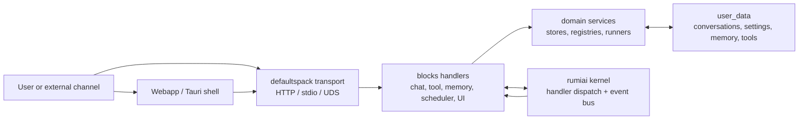
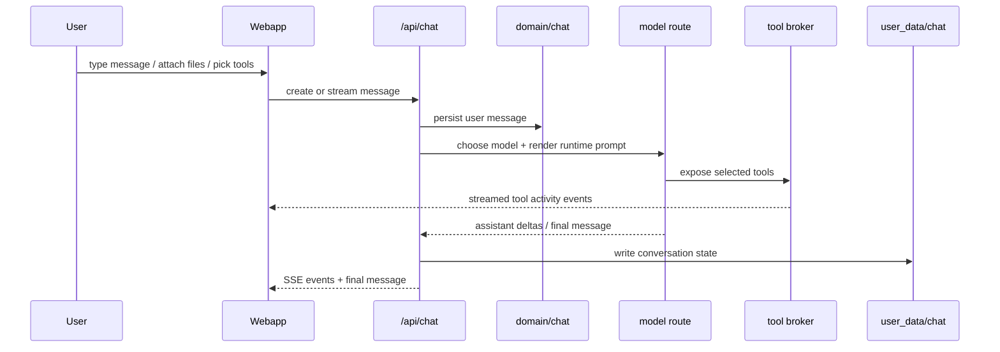
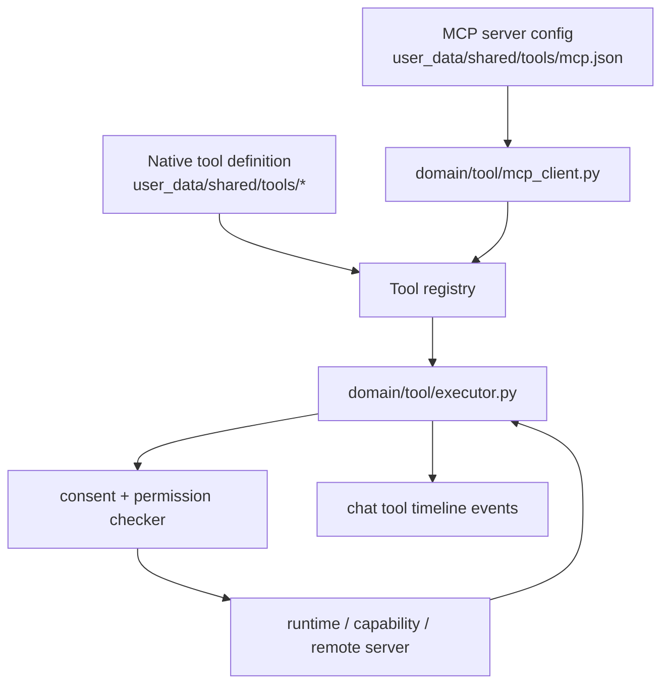
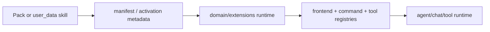
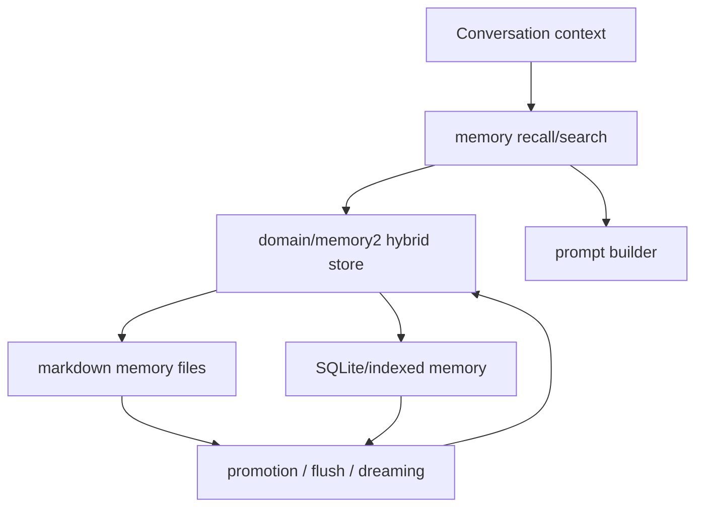
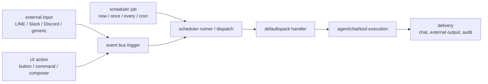

<!-- docs-i18n-links:start -->
[EN](../../defaultspack-explained.md) | [JP](../ja/defaultspack-explained.md) | [KR](./defaultspack-explained.md) | [CN](../zh-cn/defaultspack-explained.md)
<!-- docs-i18n-links:end -->

# defaultspack 설명

이 문서는 defaultspack의 PR97 방향 맵입니다. 그것은 방법을 설명합니다
로컬 우선 UI, 채팅 런타임, 도구, MCP, 규칙, 기술, 메모리, 스케줄러 및
커널이 알 필요 없이 트리거 표면이 서로 맞습니다.
도메인별 동작.

## 용어

- `rule`은 범위 내에서 적용되는 상시 실행 명령 계층을 의미합니다.
- `skill`은 트리거 기반 또는 주문형 지침 및 작업 흐름 번들을 의미합니다.
  지도.
- `prompt`은 소스 자산 또는 렌더링된 모델 텍스트를 의미합니다.
  달리기.
- `system prompt`은 시스템 역할 슬라이스에 대한 하위 수준 API/런타임 용어입니다.
  그 렌더링된 프롬프트의.
- `delegation`은 작업을 다른 에이전트에게 보내는 정식 작업입니다.
  `subagent`은 여전히 호환성 필드나 이전 문서에 나타날 수 있지만
  선호되는 아키텍처 용어는 아닙니다.

## 큰 그림

defaultspack은 rumiai의 표준 "AI 서비스" 팩입니다. 커널은 다음을 제공합니다.
팩 로딩, 핸들러 디스패치, 이벤트 및 전송 프리미티브; 기본 팩
구체적인 채팅, 도구, 메모리, 스케줄러 및 프런트엔드 동작을 제공합니다.
사용자 경험.

중요한 경계는 콘텐츠가 제거 가능한 상태로 유지된다는 것입니다. 기본팩 소모품
인프라 및 기본값; user_data 및 기타 팩이 UI를 대체할 수 있음
자산, 규칙, 프롬프트 자산, 도구, 에이전트, 일정, 메모리 파일 및 스킬
정의.

## UI 및 채팅 흐름

`webapp/`의 독립형 웹앱은 다음에 의해 노출된 `/api/...` 엔드포인트와 통신합니다.
defaultspack. UI는 기록, 채팅 메시지, 작성기,
활동 미리보기, 오른쪽 사이드바, 설정 및 선택적 코딩 조종석 영역.

채팅 메시지는 단순한 텍스트가 아닙니다. 콘텐츠 블록, 위젯, 도구를 운반할 수 있습니다.
로그, 브라우저 스크린샷, 활동 이벤트. 렌더러가 얼마만큼을 결정합니다.
메시지 타임라인과 활동에 표시되는 구조화된 데이터
미리보기 창.

## 도구 및 MCP 흐름

기본 도구와 MCP 도구는 동일한 도구 레지스트리 및 실행 뒤에 수렴됩니다.
계약. 모델에는 통합 카탈로그가 표시됩니다. 실행자는 도구 여부를 결정합니다.
로컬, 기능 지원, HTTP 지원 또는 MCP 지원입니다.

MCP 통합은 통화 시 의도적으로 투명합니다. 다음과 같은 도구
`mcp_fs_read_file`은 `defaults.tool.invoke`과 동일한 경로를 통해 호출됩니다.
네이티브 도구. 승인 모드, 권한 및 감사 동작은 계속 유지됩니다.
요청한 모델이 아닌 도구 호출.

### 증거 기반 검증

PR97 수표는 보조 산문이나 고정 마커 문자열을 증거로 취급해서는 안 됩니다.
증거는 모델이 위조할 수 없다는 구조화된 런타임 증거에 존재합니다.
비슷한 텍스트를 입력합니다.

보조 메시지 텍스트는 도구, MCP 서버, 기술, 트리거,
위임 또는 삭제된 채팅 컨텍스트가 실제로 실행되었습니다. "나는 사용했다"와 같은 산문을 다루십시오.
도구"는 표시 텍스트로만 사용됩니다. 합격/불합격 결정은 체계적으로 읽어야 합니다.
런타임에 의해 생성된 레코드 또는 다음에 의해 관찰되는 가시적 UI 상태
브라우저/극작가.

| Claim | Evidence to check |
|---|---|
| MCP was usable by Rumi | assistant message `tool_logs`, `tool_call_started`, and `tool_call_completed` contain the MCP tool id and result |
| A skill fired | assistant metadata contains `matched_skill_instructions`, and the prepared system context contains the rendered skill instruction |
| A dropped chat was referenced | user metadata contains `chat_references.references[]` with `conversation_id`, summary, and `history_json_path` |
| A trigger fired without sending | external pipeline metadata has `fire=true` and `send=false` |
| UI preview opened | Playwright/Browser observes the actual foreground dialog or timeline item, not a mocked assistant sentence |

결정론적 테스트의 경우 동적 입력을 사용하고 최종 답이 다음과 같다고 주장합니다.
도구 결과에서 파생됩니다. 라이브 브라우저 연기 테스트의 경우 통과/실패를 유지합니다.
`tool_logs`, 메타데이터 및 표시되는 UI 상태에 대한 조건 보조 텍스트는 다음과 같습니다
사람이 읽을 수 있는 부작용만 있을 뿐입니다.

API 전용 검사는 브라우저/극작가 흐름이 실패할 때 진단으로 허용됩니다.
하지만 그 자체로는 브라우저 작업 흐름이 작동한다는 것을 증명하지 못합니다. UI 계약
`/api/...`을 모의하는 테스트는 모의 UI 적용 범위로 이름을 지정하고 유지해야 합니다.
서버, 승인,
허가 및 테스트 내부 nonce 상태입니다.

## 규칙, 기술 및 확장

규칙은 상시 실행 명령 계층을 제공합니다. 기술은 타겟을 제공합니다
해당되는 경우 활성화되는 지침 및 작업 흐름 번들입니다. 기본 팩
하드코딩된 런타임 지식이 아닌 확장 콘텐츠로 둘 다 처리합니다.

동일한 확장 경로에 명령, 패널, 도구 메타데이터, 규칙, 프롬프트를 추가할 수 있습니다.
자산 또는 에이전트 기능. UI는 이를 카탈로그 데이터로 수신하고
팩별 코드 없이 사이드바나 작성기에서 렌더링합니다.

## 메모리 흐름

메모리는 대화 상태, 장기 사용자/프로젝트 메모리,
검색 가능한 지식. 채팅 및 에이전트 실행은 컨텍스트 구축 시 메모리를 읽을 수 있습니다.
승인이나 정책 확인 후 지속 가능한 사실을 다시 작성할 수 있습니다.

기본 로컬 우선 규칙은 메모리가 사용자 제어 하에 저장된다는 것입니다.
경로. 클라우드 벡터 저장소 또는 원격 지식 백엔드는 나중에 추가할 수 있지만
이는 선택적 공급자이며 권한이 제한되어야 합니다.

## 스케줄러 및 트리거 흐름

스케줄러와 트리거는 동일한 핸들러와 이벤트 시스템에 대한 진입점입니다.
UI에서 사용됩니다. 트리거는 시간 일정, 외부 웹훅,
프런트엔드 작업, P2P/회사 이벤트 또는 다른 핸들러.

`no_agent` 스케줄러 작업은 의도적으로 제한됩니다. 에이전트 작업은
일반 경로는 대화 컨텍스트, 권한, 승인을 보존하므로
및 감사 기록.

## 표면 요청

| Surface | Example | Default path |
|---|---|---|
| UI chat | User sends a composer message | `/api/chat/conversations/{id}/stream` |
| UI action | Sidebar action previews a result | `/api/ui/catalog` plus action endpoint |
| Tool call | Model invokes a native or MCP tool | `defaults.tool.invoke` |
| MCP | Server exposes external tools | `domain/tool/mcp_client.py` |
| Rule | Always-on instruction layer is applied for a run | prompt assembly and runtime policy layers |
| Skill | Pack contributes workflow behavior | `domain/extensions/*` |
| Memory | Prompt builder recalls context | `domain/memory*` |
| Scheduler | Job fires on time or demand | `/api/agent/schedules` |
| Trigger | Webhook/event enters runtime | gateway, scheduler, or event bus |

## 운영규칙

- 커널을 일반으로 유지하십시오. AI 서비스 도메인 동작을 defaultspack에 넣습니다.
- 사용자 데이터를 교체 가능하게 유지합니다. 기본값은 잠금이 아닌 슬롯과 계약을 제공합니다.
- 로컬 우선 작업을 선호합니다. 원격 공급자는 선택 사항입니다.
- 도구 활동을 조기에 스트리밍합니다. UI는 최종 이전에 무슨 일이 일어나고 있는지 보여야 합니다.
  채팅 문자가 옵니다.
- 스케줄러, MCP 및 외부 입력을 통과해야 하는 트리거 표면으로 처리
  사용자가 시작한 작업과 동일한 권한, 동의 및 감사 모델을 통해.
