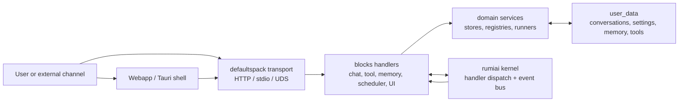
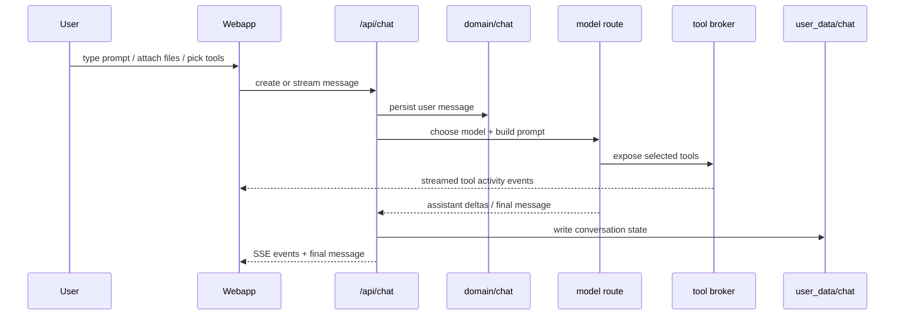
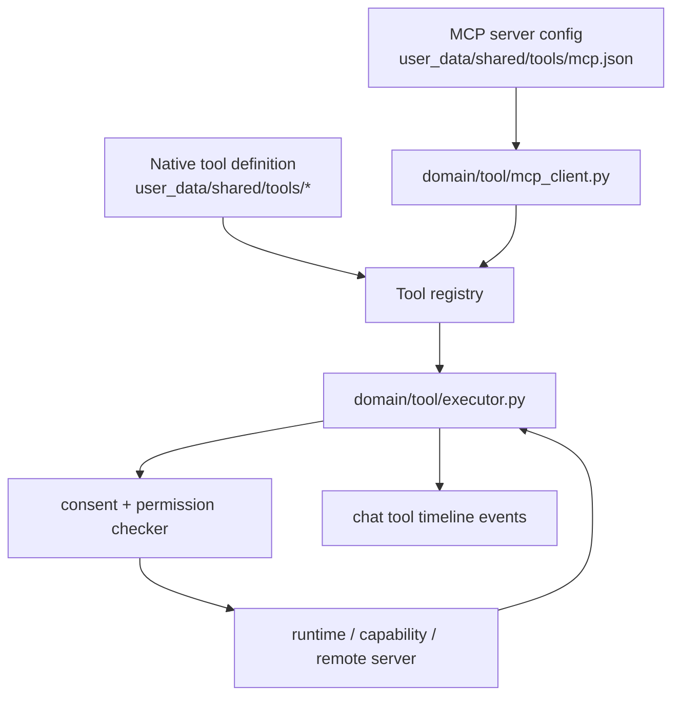
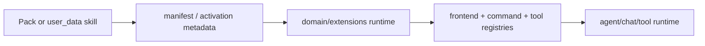
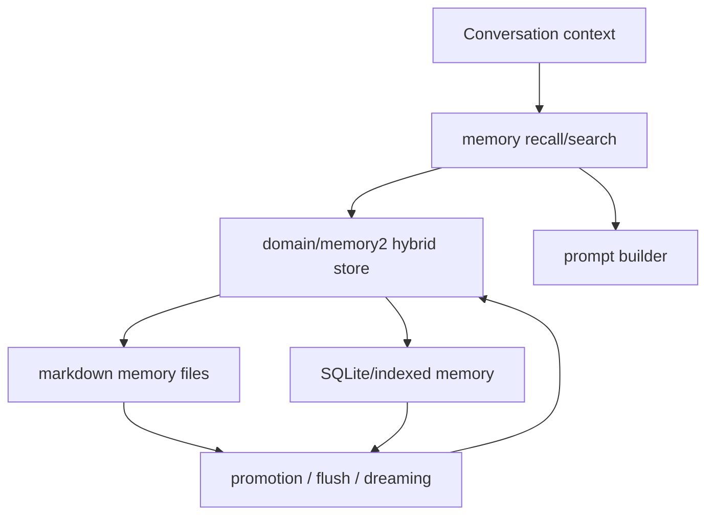
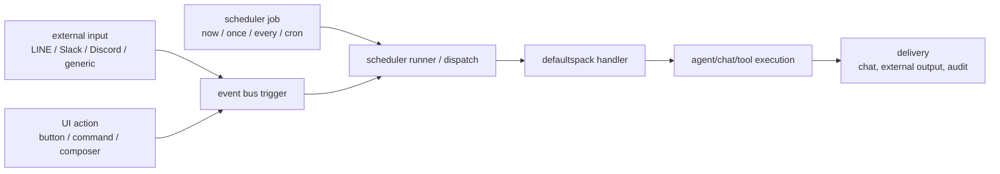

<!-- docs-i18n-links:start -->
[EN](../../defaultspack-explained.md) | [JP](../ja/defaultspack-explained.md) | [KR](../ko/defaultspack-explained.md) | [CN](./defaultspack-explained.md)
<!-- docs-i18n-links:end -->

# 默认包解释

本文档是 defaultspack 的 PR97 方向图。它解释了如何
本地优先 UI、聊天运行时、工具、MCP、技能、内存、调度程序和触发器
表面可以组合在一起，而不需要内核知道任何特定于领域的信息
行为。

## 大局观

defaultspack是rumiai的标准“AI服务”包。内核提供了
包加载、处理程序调度、事件和传输原语；默认包
提供具体的聊天、工具、内存、调度程序和前端行为
用户体验。

重要的界限是内容仍然是可移动的。默认包装用品
基础设施和默认设置； user_data等包可以替代UI
资产、提示、工具、代理、时间表、内存文件和技能定义。

## UI 和聊天流程

`webapp/` 中的独立 Web 应用程序与 `/api/...` 暴露的端点进行通信
默认包。 UI 呈现一个带有历史记录、聊天消息、作曲家的 shell，
活动预览、右侧边栏、设置和可选的编码驾驶舱区域。

聊天消息不仅仅是文本。它们可以携带内容块、小部件、工具
日志、浏览器屏幕截图和活动事件。渲染器决定多少
结构化数据在消息时间轴和活动中的显示
预览窗格。

## 工具和 MCP 流程

本机工具和 MCP 工具融合在相同的工具注册表和执行中
合同。模型看到统一的目录；执行者决定是否使用一个工具
是本地的、功能支持的、HTTP 支持的或 MCP 支持的。

MCP 集成在呼叫时有意保持透明。一个工具，例如
`mcp_fs_read_file` 通过与 `defaults.tool.invoke` 相同的路径调用
原生工具。审批模式、权限、审核行为依附于
工具调用而不是请求它的模型。

### 循证验证

PR97 检查不应将辅助散文或固定标记字符串视为证据。
证明存在于结构化的运行时证据中，模型无法通过以下方式伪造
输入类似的文字。

辅助消息文本绝不是工具、MCP 服务器、技能、触发器、
或者删除了实际运行的聊天上下文。将诸如“我使用该工具”之类的散文视为
仅显示文本；通过/失败决策必须读取由以下机构生成的结构化记录
浏览器/Playwright 观察到的运行时或可见 UI 状态。

|索赔 |需要检查的证据|
|---|---|
| Rumi 可以使用 MCP |辅助消息`tool_logs`、`tool_call_started`和`tool_call_completed`包含MCP工具ID和结果|
|技能已发射 |助手元数据包含`matched_skill_instructions`，准备好的系统上下文包含渲染的技能指令 |
|引用了一条已删除的聊天记录 |用户元数据包含`chat_references.references[]`、`conversation_id`、摘要和`history_json_path` |
|触发器在未发送的情况下触发 |外部管道元数据有`fire=true`和`send=false`|
| UI 预览已打开 |剧作家/浏览器观察实际的前景对话框或时间线项目，而不是模拟的助手句子 |

对于确定性测试，使用动态输入并断言最终答案是
从工具结果得出。对于实时浏览器冒烟测试，保留通过/失败
`tool_logs`、元数据和可见 UI 状态的条件；助理文本是
只是人类可读的副作用。

当浏览器/剧作家流程失败时，允许仅使用 API 检查作为诊断，
但它们本身并不能证明浏览器工作流程有效。 UI合约
模拟 `/api/...` 的测试应命名为模拟 UI 覆盖率并保留
与实时 MCP 证据测试分开，后者必须创建任何服务器、批准、
许可，以及测试中的随机数状态。

## 技能和扩展

技能是帮助代理或工具执行的打包行为和指令
专门的工作流程。 defaultspack 将它们视为扩展内容而不是
比硬编码的运行时知识。

相同的扩展路径可以添加命令、面板、工具元数据、提示或
代理能力。 UI 接收这些作为目录数据并将它们呈现在
侧边栏或作曲家，无需特定于包的代码。

## 内存流

内存分为对话状态、长期用户/项目内存和
可搜索的知识。聊天和代理运行可以在构建上下文时读取内存
并可以在批准或政策检查后写回持久的事实。

默认的本地优先规则是内存在用户控制下存储
路径。可以稍后添加云矢量存储或远程知识后端，但是
它们是可选的提供者，应该受到许可限制。

## 调度程序和触发流程

调度程序和触发器是同一处理程序和事件系统的入口点
由用户界面使用。触发器可以来自时间表、外部 Webhook、
前端操作、P2P/公司事件或其他处理程序。

`no_agent` 调度程序作业受到故意限制。代理职位是
正常路径，因为它们保留对话上下文、权限、批准，
和审计记录。

## 请求表面

|表面|示例|默认路径 |
|---|---|---|
|用户界面聊天|用户发送作曲家提示 | §鲁米§0§|
|用户界面操作 |侧边栏操作预览结果 | `/api/ui/catalog` 加行动端点 |
|工具调用|模型调用本机或 MCP 工具 | §鲁米§0§|
| MCP|服务器公开外部工具| §鲁米§0§|
|技能| Pack 贡献工作流程行为 | §鲁米§0§|
|内存|提示构建器回忆上下文 | §鲁米§0§|
|调度程序|按时或按需解雇工作 | §鲁米§0§|
|触发| Webhook/事件进入运行时 |网关、调度程序或事件总线 |

## 操作规则

- 保持内核通用；将 AI 服务域行为放入 defaultspack 中。
- 保持用户数据可替换；默认提供插槽和合约，而不是锁定。
- 优先选择本地操作；远程提供商可以选择加入。
- 尽早流式传输工具活动；用户界面应该显示最终之前发生的情况
  聊天文本到达。
- 将调度程序、MCP 和外部输入视为必须通过的触发表面
  通过与用户启动的工作相同的许可、同意和审核模型。
